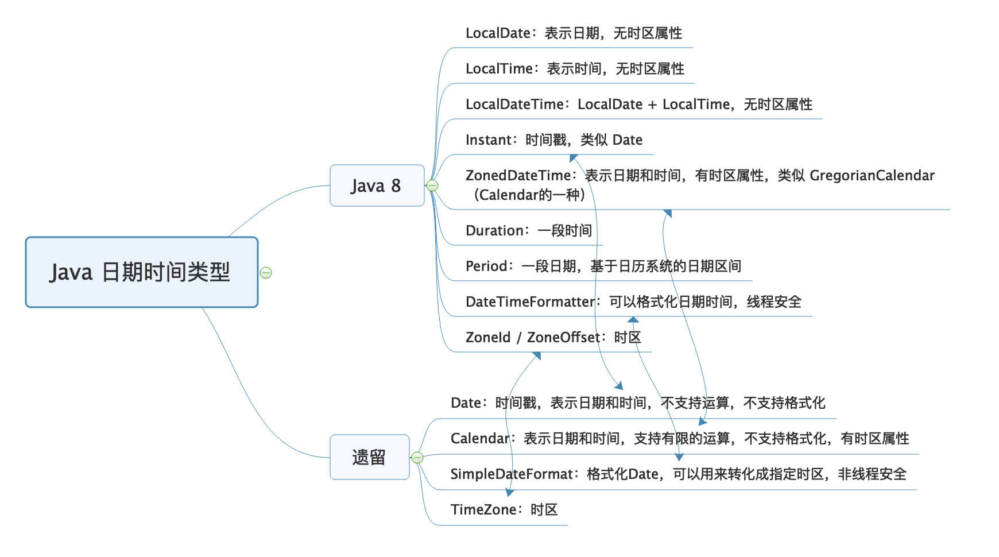

## 用好Java 8的日期时间类，少踩一些“老三样”的坑



### 1. 初始化日期时间

参考代码：[newdate](newdate)

年应该是和 1900 的差值，月应该是从 0 到 11 而不是从 1 到 12

### 2. “恼人”的时区问题

参考代码：[timezone](timezone)

> 全球有 24 个时区，同一个时刻不同时区（比如中国上海和美国纽约）的时间是不一样的。对于需要全球化的项目，如果初始化时间时没有提供时区，那就不是一个真正意义上的时间，只能认为是我看到的当前时间的一个表示。

关于 Date 类，要有两点认识：

- 一是，Date 并无时区问题，世界上任何一台计算机使用 new Date() 初始化得到的时间都一样。因为，
  Date 中保存的是 UTC 时间，**UTC 是以原子钟为基础的统一时间，不以太阳参照计时，并无时区划分。**
- 二是，Date 中保存的是一个时间戳，代表的是从 1970 年 1 月 1 日 0 点（Epoch 时间）到现在的毫秒数。
  尝试输出 Date(0)：
  System.out.println(new Date(0));
  System.out.println(TimeZone.getDefault().getID() + ":" + TimeZone.getDefault().getRawOffset()/3600000);
  ===> `Thu Jan 01 08:00:00 CST 1970Asia/Shanghai:8`

对于国际化（世界各国的人都在使用）的项目，处理好时间和时区问题首先就是要正确保存日期时间。有两种保存方式：

- 方式一，以 UTC 保存，保存的时间没有时区属性，是不涉及时区时间差问题的世界统一时间。我们通常说的时间戳，或 Java 中的 Date
  类就是用的这种方式，这也是推荐的方式。(**这正是 UTC 的意义，并不是时间错乱。对于同一个本地时间的表示，不同时区的人解析得到的
  UTC 时间一定是不同的，反过来不同的本地时间可能对应同一个 UTC。**)
- 方式二，以字面量保存，比如年 / 月 / 日 时: 分:
  秒，一定要同时保存时区信息。只有有了时区信息，才能知道这个字面量时间真正的时间点，否则它只是一个给人看的时间表示，只在当前时区有意义。Calendar
  是有时区概念的，所以我们通过不同的时区初始化 Calendar，得到了不同的时间。

**要正确处理时区，在于存进去和读出来两方面：**

- **存的时候，需要使用正确的当前时区来保存，这样 UTC 时间才会正确；**
- **读的时候，也只有正确设置本地时区，才能把 UTC 时间转换为正确的当地时间。**

**Java 8 推出了新的时间日期类**

- **ZoneId** :
    - 使用 ZoneId.of 来初始化一个标准的时区
- **ZoneOffset** :
    - 使用 ZoneOffset.ofHours 通过一个 offset，来初始化一个具有指定时间差的自定义时区
- **LocalDateTime**、**ZonedDateTime**
    - 对于日期时间表示，LocalDateTime 不带有时区属性，所以命名为本地时区的日期时间
    - ZonedDateTime=LocalDateTime+ZoneId，具有时区属性
    - 因此，LocalDateTime 只能认为是一个时间表示，ZonedDateTime 才是一个有效的时间。
- **DateTimeFormatter**
    - 使用 DateTimeFormatter 格式化时间的时候，可以直接通过 withZone 方法直接设置格式化使用的时区。

**小结**
**正确处理国际化时间问题，推荐使用 Java 8 的日期时间类，即使用 ZonedDateTime 保存时间，然后使用设置了 ZoneId 的
DateTimeFormatter 配合 ZonedDateTime 进行时间格式化得到本地时间表示。这样的划分十分清晰、细化，也不容易出错。**

### 3. 日期时间格式化和解析

参考代码：[dateformat](dateformat)

#### SimpleDateFormat

- SimpleDateFormat 的各种格式化模式。小写 y 是年，而大写 Y 是 week year，也就是所在的周属于哪一年。

    - 一年第一周的判断方式是，从 getFirstDayOfWeek() 开始，完整的 7 天，并且包含那一年至少
      getMinimalDaysInFirstWeek() 天。这个计算方式和区域相关，对于当前 zh_CN 区域来说，2020 年第一周的条件是，从周日开始的完整
      7 天，2020 年包含 1 天即可。显然，2019 年 12 月 29 日周日到2020 年 1 月 4 日周六是 2020 年第一周，得出的 week year 就是
      2020 年。

- 定义的 static 的 SimpleDateFormat 可能会出现线程安全问题(除非特殊处理，通过 ThreadLocal 来存放 SimpleDateFormat)
    - SimpleDateFormat 继承了 DateFormat，DateFormat 有一个字段 Calendar；
    - SimpleDateFormat 的 parse 方法调用 CalendarBuilder 的 establish 方法，来构建 Calendar；
    - **establish 方法内部先清空 Calendar 再构建 Calendar，整个操作没有加锁。**
    - format 方法也类似

      ```java
      public abstract class DateFormat extends Format {
          protected Calendar calendar;
      }
      public class SimpleDateFormat extends DateFormat {
          @Override
          public Date parse(String text, ParsePosition pos)
          {
              CalendarBuilder calb = new CalendarBuilder();
          parsedDate = calb.establish(calendar).getTime();
              return parsedDate;
          }
      }
      
      class CalendarBuilder {
        Calendar establish(Calendar cal) {
              // ...
              cal.clear();//清空
      
              for (int stamp = MINIMUM_USER_STAMP; stamp < nextStamp; stamp++) {
                  for (int index = 0; index <= maxFieldIndex; index++) {
                      if (field[index] == stamp) {
                          cal.set(index, field[MAX_FIELD + index]);//构建
                          break;
                      }
                  }
              }
              return cal;
          }
      }
      ```
- 当需要解析的字符串和格式不匹配的时候，SimpleDateFormat 表现得很宽容，还是能得到结果。

  ```java
  String dateString = "20160901";
  SimpleDateFormat dateFormat = new SimpleDateFormat("yyyyMM");
  System.out.println("result:" + dateFormat.parse(dateString));
  // 输出了 2091 年 1 月 1 日，原因是把 0901 当成了月份，相当于 75 年
  ```

#### DateTimeFormatter

1. 不用去记忆使用大写的 Y 还是小写的 Y，大写的 M 还是小写的 m
2. **DateTimeFormatter 线程安全**
3. DateTimeFormatter 的解析比较严格，需要解析的字符串和格式不匹配时，会直接报错，而不会把
   0901 解析为月份

```java
private static DateTimeFormatter dateTimeFormatter = new DateTimeFormatterBuilder()
            .appendValue(ChronoField.YEAR)
            .appendLiteral("/")
            .appendValue(ChronoField.MONTH_OF_YEAR)
            .appendLiteral("/")
            .appendValue(ChronoField.DAY_OF_MONTH)
            .appendLiteral(" ")
            .appendValue(ChronoField.HOUR_OF_DAY)
            .appendLiteral(":")
            .appendValue(ChronoField.MINUTE_OF_HOUR)
            .appendLiteral(":")
            .appendValue(ChronoField.SECOND_OF_MINUTE)
            .appendLiteral(".")
            .appendValue(ChronoField.MILLI_OF_SECOND)
            .toFormatter();
```

### 4. 日期时间的计算

参考代码：[calc](calc)

- 使用 Java 8 的日期时间类型，可以直接进行各种计算，更加简洁和方便：
- 对日期时间做计算操作，Java 8 日期时间 API 会比 Calendar 功能强大很多

**使用 Java 8 操作和计算日期时间虽然方便，但计算两个日期差时可能会踩坑：**
Java 8 中有一个专门的类 Period 定义了日期间隔，通过 Period.between 得到了两个 LocalDate 的差，**返回的是两个日期差几年零几月零几天
**。**如果希望得知两个日期之间差几天，直接调用 Period 的 getDays() 方法得到的只是最后的“零几天”，而不是算总的间隔天数。**

这里有个误区是：

- 认为 java.util.Date 类似于新 API 中的 LocalDateTime。其实不是，虽然它们都没有时区概念，但
  java.util.Date 类是因为使用 UTC 表示，所以没有时区概念，**其本质是时间戳**；
- 而 LocalDateTime，严格上可以认为**是一个日期时间的表示**，而不是一个时间点。

**Date 转换为 LocalDateTime**

- 通过 Date 的 toInstant 方法得到一个 UTC 时间戳进行转换，并需要提供当前的时区，这样才能把 UTC 时
  间转换为本地日期时间（的表示）

**LocalDateTime 的时间表示转换为 Date**

- 需要提供时区，用于指定是哪个时区的时间表示，也就是先通过 atZone 方法把 LocalDateTime 转换为
  ZonedDateTime，然后才能获得 UTC 时间戳

  ```java
  Date in = new Date();
  LocalDateTime ldt = LocalDateTime.ofInstant(in.toInstant(), ZoneId.systemDefault());
  Date out = Date.from(ldt.atZone(ZoneId.systemDefault()).toInstant());
  ```

### 问题

#### 在这一讲中，我多次强调了 Date 是一个时间戳，是 UTC 时间、没有时区概念。那，为什么调用其 toString 方法，会输出类似 CST 之类的时区字样呢？

关于这个问题，参考 toString 中的相关源码，你可以看到会获取当前时区（取不到则显示 GMT）进行格式化。其实说白了，这里显示的时区仅仅用于呈现，并不代表
Date 类内置了时区信息。

#### 日期时间数据始终要保存到数据库中，MySQL 中有两种数据类型 datetime 和 timestamp 可以用来保存日期时间。你能说说它们的区别吗，它们是否包含时区信息呢？

- 占用空间：
    - datetime 占用 8 字节；
    - timestamp 占用 4 字节。
- 表示的时间范围：
    - datetime 表示的范围是从“1000-01-01 00:00:00.000000”到“9999-12-31 23:59:59.999999”；
    - timestamp 表示的范围是从“1970-01-01 00:00:01.000000”到“2038-01-19 03:14:07.999999”。
- 时区：
    - timestamp 保存的时候根据当前时区转换为 UTC，查询的时候再根据当前时区从 UTC 转回来；
    - datetime 就是一个死的字符串时间（仅仅对 MySQL 本身而言）表示。