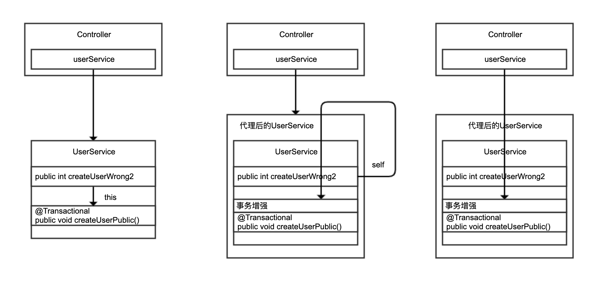

## 20%的业务代码的Spring声明式事务，可能都没处理正确

### 1. 小心 Spring 的事务可能没有生效

参考代码：[transactionproxyfailed](transactionproxyfailed)

- @Transactional 生效原则 1，除非特殊配置（比如使用 AspectJ 静态织入实现 AOP），否则只有定义在 public 方法上的
  @Transactional 才能生效。
    - 原因是，Spring 默认通过动态代理的方式实现 AOP，对目标方法进行增强，private 方法无法代理到，Spring 自然也无法动态增强事务处理逻辑。
- @Transactional 生效原则 2，必须通过代理过的类从外部调用目标方法才能生效。
    - Spring 通过 AOP 技术对方法进行增强，要调用增强过的方法必然是调用代理后的对象。
- CGLIB 通过继承方式实现代理类，private 方法在子类不可见，自然也就无法进行事务增强；
- this 指针代表对象自己，Spring 不可能注入 this，所以通过 this 访问方法必然不是代理。

把 this 改为 self 后测试发现，在 Controller 中调用 createUserRight 方法可以验证事务是生效的，非法的用户注册操作可以回滚。

虽然在 UserService 内部注入自己调用自己的 createUserPublic 可以正确实现事务，但更合理的实现方式是，让 Controller 直接调用之前定义的
UserService 的 createUserPublic 方法，因为注入自己调用自己很奇怪，也不符合分层实现的规范

this 自调用、通过 self 调用，以及在 Controller 中调用 UserService 三种实现的区别：

强烈建议你在开发时打开相关的 Debug 日志，以方便了解 Spring 事务实现的细节，并及时判断事务的执行情况。

比如使用 JPA：

logging.level.org.springframework.orm.jpa=DEBUG

开启日志后，再比较下在 UserService 中通过 this 调用和在 Controller 中通过注入的 UserService Bean 调用 createUserPublic
区别。很明显，this 调用因为没有走代理，事务没有在 createUserPublic 方法上生效，只在 Repository 的 save 方法层面生效：

```
//在UserService中通过this调用public的createUserPublic
[16:12:59.756][http-nio-45678-exec-1][DEBUG][o.s.orm.jpa.JpaTransactionManager:370]-Creating new
transaction with name [org.springframework.data.jpa.repository.support.SimpleJpaRepository.save]:PROPAGATION_REQUIRED,ISOLATION_DEFAULT
//在Controller中通过注入的UserService Bean调用createUserPublic
[16:13:56.473][http-nio-45678-exec-3][DEBUG][o.s.orm.jpa.JpaTransactionManager:370]-Creating new
transaction with name [org.coder.err.programming._1_code_chapter.transaction.transactionproxyfailed.UserService.createUserPublic]:PROPAGATION_REQUIRED,ISOLATION_DEFAULT
```

可能还会考虑一个问题，这种实现在 Controller 里处理了异常显得有点繁琐，还不如直接把 createUserWrong2 方法加上
@Transactional 注解，然后在 Controller 中直接调用这个方法。这样一来，既能从外部（Controller 中）调用 UserService 中的方法，方法又是
public 的能够被动态代理 AOP 增强。



你可以试一下这种方法，但很容易就会踩第二个坑，即因为没有正确处理异常，导致事务即便生效也不一定能回滚。
`logging.level.org.springframework.orm.jpa=DEBUG`

### 2. 事务即便生效也不一定能回滚

参考代码：[transactionrollbackfailed](transactionrollbackfailed)

通过 AOP 实现事务处理可以理解为，使用 try…catch…来包裹标记了 @Transactional 注解的方法，当方法出现了异常并且满足一定条件的时候，在
catch 里面可以设置事务回滚，没有异常则直接提交事务。

这里的“一定条件”，主要包括两点：

- 只有异常传播出了标记了 @Transactional 注解的方法，事务才能回滚。
    - 在 Spring 的 TransactionAspectSupport 里有个 invokeWithinTransaction 方法，里面就是处理事务的逻辑。可以看到，只有捕获到异常才能进行后续事务处理：

- 默认情况下，出现 RuntimeException（非受检异常）或 Error 的时候，Spring 才会回滚事务。

打开 Spring 的 DefaultTransactionAttribute 类能看到如下代码块，可以发现相关证据，通过注释也能看到 Spring
这么做的原因，大概的意思是受检异常一般是业务异常，或者说是类似另一种方法的返回值，出现这样的异常可能业务还能完成，所以不会主动回滚；而
Error 或 RuntimeException 代表了非预期的结果，应该回滚。

如果希望捕获异常进行处理的话，也没关系，可以手动设置让当前事务处于回滚状态。注意到“Transactional code has requested
rollback”的提示，表明手动请求回滚：

```
.....
[10:11:09.367][http-nio-45678-exec-9][DEBUG][o.s.orm.jpa.JpaTransactionManager:698]-
Transactional code has requested rollback
[10:11:09.367][http-nio-45678-exec-9][DEBUG][o.s.orm.jpa.JpaTransactionManager:834]-
Initiating transaction rollback
[10:11:09.370][http-nio-45678-exec-9][DEBUG][o.s.orm.jpa.JpaTransactionManager:555]-
Rolling back JPA transaction on EntityManager[SessionImpl(572623149<open>)]
[10:11:09.374][http-nio-45678-exec-9][DEBUG][o.s.orm.jpa.JpaTransactionManager:620]-
Closing JPA EntityManager [SessionImpl(572623149<open>)] after transaction
[10:11:09.375][http-nio-45678-exec-9][DEBUG][o.s.o.j.SharedEntityManagerCreator$SharedEntityManagerInvocationHandler:305]-Creating new EntityManager for
shared EntityManager invocation
```

在注解中声明，期望遇到所有的 Exception 都回滚事务（来突破默认不回滚受检异常的限制），可以在日志中看到回滚的提示：

```
[10:24:37.717][http-nio-45678-exec-3][DEBUG][o.s.orm.jpa.JpaTransactionManager:834]-
Initiating transaction rollback
[10:24:37.718][http-nio-45678-exec-3][DEBUG][o.s.orm.jpa.JpaTransactionManager:555]-
Rolling back JPA transaction on EntityManager[SessionImpl(1605726388<open>)]
```

### 3. 请确认事务传播配置是否符合自己的业务逻辑

参考代码：[transactionpropagation](transactionpropagation)

期望子用户的注册作为一个事务单独回滚，不影响主用户的注册，这样的逻辑可以实现吗？

```
[10:40:32.524][http-nio-45678-exec-6][DEBUG][o.s.orm.jpa.JpaTransactionManager:555]-
Rolling back JPA transaction on EntityManager[SessionImpl(414990171<open>)]
[10:40:32.530][http-nio-45678-exec-6][DEBUG][o.s.orm.jpa.JpaTransactionManager:620]-
Closing JPA EntityManager [SessionImpl(414990171<open>)] after transaction
[10:40:32.531][http-nio-45678-exec-6][ERROR][o.c.e.c.t.t.TransactionPropagationController:23]-
createUserWrong failed, reason: invalid status
```

你马上就会意识到，不对呀，因为运行时异常逃出了 @Transactional 注解标记的 createUserWrong 方法，Spring
当然会回滚事务了。如果我们希望主方法不回滚，应该把子方法抛出的异常捕获了。也就是这么改，把
subUserService.createSubUserWithExceptionWrong 包裹上 catch，这样外层主方法就不会出现异常了：

虽然捕获了异常，但是因为没有开启新事务，而当前事务因为异常已经被标记为rollback了，所以最终还是会回滚。

```
[10:44:13.216][http-nio-45678-exec-8][DEBUG][o.s.orm.jpa.JpaTransactionManager:370]-Creating new
transaction with name [org.coder.err.programming._1_code_chapter.transaction.transactionpropagation.UserService.createUserWrong2]:PROPAGATION_REQUIRED,ISOLATION_DEFAULT
[10:44:13.221][http-nio-45678-exec-8][DEBUG][o.s.orm.jpa.JpaTransactionManager:393]-Opened new EntityManager [SessionImpl(417799760<open>)]for JPA transaction
[10:44:13.225][http-nio-45678-exec-8][DEBUG][o.s.orm.jpa.JpaTransactionManager:421]-Exposing JPA
transaction as JDBC [org.springframework.orm.jpa.vendor.HibernateJpaDialect$HibernateConnectionHandle@1620e33c]
[10:44:13.225][http-nio-45678-exec-8][DEBUG][o.s.orm.jpa.JpaTransactionManager:356]-
Found thread-bound EntityManager[SessionImpl(417799760<open>)]for JPA transaction
[10:44:13.226][http-nio-45678-exec-8][DEBUG][o.s.orm.jpa.JpaTransactionManager:471]-
Participating in existing transaction
[10:44:13.235][http-nio-45678-exec-8][INFO ][o.c.e.c.t.t.UserService:57]-createMainUser finish
[10:44:13.236][http-nio-45678-exec-8][DEBUG][o.s.orm.jpa.JpaTransactionManager:356]-
Found thread-bound EntityManager[SessionImpl(417799760<open>)]for JPA transaction
[10:44:13.237][http-nio-45678-exec-8][DEBUG][o.s.orm.jpa.JpaTransactionManager:471]-
Participating in existing transaction
[10:44:13.237][http-nio-45678-exec-8][INFO ][o.c.e.c.t.t.SubUserService:19]-
createSubUserWithExceptionWrong start
[10:44:13.237][http-nio-45678-exec-8][DEBUG][o.s.orm.jpa.JpaTransactionManager:356]-
Found thread-bound EntityManager[SessionImpl(417799760<open>)]for JPA transaction
[10:44:13.238][http-nio-45678-exec-8][DEBUG][o.s.orm.jpa.JpaTransactionManager:471]-
Participating in existing transaction
[10:44:13.238][http-nio-45678-exec-8][DEBUG][o.s.orm.jpa.JpaTransactionManager:843]-
Participating transaction failed - marking existing transaction as rollback-only
[10:44:13.239][http-nio-45678-exec-8][DEBUG][o.s.orm.jpa.JpaTransactionManager:580]-
Setting JPA transaction on EntityManager [SessionImpl(417799760<open>)]rollback-only
[10:44:13.239][http-nio-45678-exec-8][ERROR][o.c.e.c.t.t.UserService:39]-
create sub user error: invalid status
[10:44:13.239][http-nio-45678-exec-8][DEBUG][o.s.orm.jpa.JpaTransactionManager:741]-
Initiating transaction commit
[10:44:13.240][http-nio-45678-exec-8][DEBUG][o.s.orm.jpa.JpaTransactionManager:529]-
Committing JPA transaction on EntityManager [SessionImpl(417799760<open>)]
[10:44:13.242][http-nio-45678-exec-8][DEBUG][o.s.orm.jpa.JpaTransactionManager:620]-
Closing JPA EntityManager [SessionImpl(417799760<open>)] after transaction
[10:44:13.246][http-nio-45678-exec-8][ERROR][o.c.e.c.t.t.TransactionPropagationController:33]-createUserWrong2 failed, reason:
Transaction silently rolled back because it has been marked as rollback-only
org.springframework.transaction.UnexpectedRollbackException: Transaction silently
rolled back because it has been marked as rollback-only
```

需要注意以下几点：

- 如第 1 行所示，对 createUserWrong2 方法开启了异常处理；
- 如第 12 行所示，子方法因为出现了运行时异常，标记当前事务为回滚；
- 如第 14 行所示，主方法的确捕获了异常打印出了 create sub user error 字样；
- 如第 16 行所示，主方法提交了事务；
- 奇怪的是，如第 18 行和 19 行所示，Controller 里出现了一个
  UnexpectedRollbackException，异常描述提示最终这个事务回滚了，而且是静默回滚的。之所以说是静默，是因为 createUserWrong2
  方法本身并没有出异常，只不过提交后发现子方法已经把当前事务设置为了回滚，无法完成提交。

想办法让子逻辑在独立事务中运行，也就是改一下 SubUserService 注册子用户的方法，为注解加上 propagation =
Propagation.REQUIRES_NEW 来设置 REQUIRES_NEW 方式的事务传播策略，也就是执行到这个方法时需要开启新的事务，并挂起当前事务：

```
[10:56:11.949][http-nio-45678-exec-3][DEBUG][o.s.orm.jpa.JpaTransactionManager:370]-Creating new
transaction with name [org.coder.err.programming._1_code_chapter.transaction.transactionpropagation.UserService.createUserRight]:PROPAGATION_REQUIRED,ISOLATION_DEFAULT
[10:56:11.950][http-nio-45678-exec-3][DEBUG][o.s.orm.jpa.JpaTransactionManager:393]-Opened new EntityManager [
SessionImpl(615249692<open>)]for JPA transaction
[10:56:11.956][http-nio-45678-exec-3][DEBUG][o.s.orm.jpa.JpaTransactionManager:421]-
Exposing JPA transaction as JDBC [org.springframework.orm.jpa.vendor.HibernateJpaDialect$HibernateConnectionHandle@6dabe4f9]
[10:56:11.956][http-nio-45678-exec-3][DEBUG][o.s.orm.jpa.JpaTransactionManager:356]-
Found thread-bound EntityManager[SessionImpl(615249692<open>)]for JPA transaction
[10:56:11.956][http-nio-45678-exec-3][DEBUG][o.s.orm.jpa.JpaTransactionManager:471]-
Participating in existing transaction
[10:56:11.970][http-nio-45678-exec-3][INFO ][o.c.e.c.t.t.UserService:57]-createMainUser finish
[10:56:11.971][http-nio-45678-exec-3][DEBUG][o.s.orm.jpa.JpaTransactionManager:356]-
Found thread-bound EntityManager[SessionImpl(615249692<open>)]for JPA transaction
[10:56:11.971][http-nio-45678-exec-3][DEBUG][o.s.orm.jpa.JpaTransactionManager:420]-
Suspending current transaction,creating new transaction with name [org.coder.err.programming._1_code_chapter.transaction.transactionpropagation.SubUserService.createSubUserWithExceptionRight]
[10:56:11.971][http-nio-45678-exec-3][DEBUG][o.s.orm.jpa.JpaTransactionManager:393]-Opened new EntityManager [
SessionImpl(1124438028<open>)]for JPA transaction
[10:56:11.973][http-nio-45678-exec-3][DEBUG][o.s.orm.jpa.JpaTransactionManager:421]-
Exposing JPA transaction as JDBC [org.springframework.orm.jpa.vendor.HibernateJpaDialect$HibernateConnectionHandle@321c499b]
[10:56:11.973][http-nio-45678-exec-3][INFO ][o.c.e.c.t.t.SubUserService:26]-
createSubUserWithExceptionRight start
[10:56:11.973][http-nio-45678-exec-3][DEBUG][o.s.orm.jpa.JpaTransactionManager:356]-
Found thread-bound EntityManager[SessionImpl(1124438028<open>)]for JPA transaction
[10:56:11.973][http-nio-45678-exec-3][DEBUG][o.s.orm.jpa.JpaTransactionManager:471]-
Participating in existing transaction
[10:56:11.982][http-nio-45678-exec-3][DEBUG][o.s.orm.jpa.JpaTransactionManager:834]-
Initiating transaction rollback
[10:56:11.982][http-nio-45678-exec-3][DEBUG][o.s.orm.jpa.JpaTransactionManager:555]-
Rolling back JPA transaction on EntityManager[SessionImpl(1124438028<open>)]
[10:56:11.983][http-nio-45678-exec-3][DEBUG][o.s.orm.jpa.JpaTransactionManager:620]-
Closing JPA EntityManager [SessionImpl(1124438028<open>)] after transaction
[10:56:11.983][http-nio-45678-exec-3][DEBUG][o.s.orm.jpa.JpaTransactionManager:1009]-
Resuming suspended transaction after completion of inner transaction
[10:56:11.984][http-nio-45678-exec-3][ERROR][o.c.e.c.t.t.UserService:51]-
create sub user error: invalid status
[10:56:11.984][http-nio-45678-exec-3][DEBUG][o.s.orm.jpa.JpaTransactionManager:741]-
Initiating transaction commit
[10:56:11.984][http-nio-45678-exec-3][DEBUG][o.s.orm.jpa.JpaTransactionManager:529]-
Committing JPA transaction on EntityManager [SessionImpl(615249692<open>)]
[10:56:11.987][http-nio-45678-exec-3][DEBUG][o.s.orm.jpa.JpaTransactionManager:620]-
Closing JPA EntityManager [SessionImpl(615249692<open>)] after transaction
[10:56:11.988][http-nio-45678-exec-3][DEBUG][o.s.o.j.SharedEntityManagerCreator$SharedEntityManagerInvocationHandler:305]-Creating new EntityManager for
shared EntityManager invocation
```

改造后，重新运行程序可以看到如下的关键日志：

- 第 1 行日志提示 createUserRight 方法开启了主方法的事务；
- 第 6 行日志提示创建主用户完成；
- 第 8 行日志可以看到主事务挂起了，开启了一个新的事务，针对 createSubUserWithExceptionRight 方案，也就是创建子用户的逻辑；
- 第 14 行日志提示子方法事务回滚；
- 第 17 行日志提示子方法事务完成，继续主方法之前挂起的事务；
- 第 18 行日志提示主方法捕获到了子方法的异常；
- 第 20 行日志提示主方法的事务提交了，随后在 Controller 里没看到静默回滚的异常。

### 4. 使用MyBatis配合Propagation.NESTED事务传播模式的例子

参考代码：[nested](nested)

- 主方法出现异常，子方法的嵌套事务也会回滚
- 每个 NESTED 事务执行前，会将当前操作保存下来，叫做 savepoint（保存点）。NESTED 事务在外部事务提交以后自己才会提交，如果当前
  NESTED 事务执行失败，则回滚到之前的保存点。

### 5. 重点回顾

针对业务代码中最常见的使用数据库事务的方式，即 Spring 声明式事务，总结了使用上可能遇到的三类坑，包括：

- 第一，因为配置不正确，导致方法上的事务没生效。务必确认调用 @Transactional 注解标记的方法是 public 的，并且是通过 Spring
  注入的 Bean 进行调用的。
- 第二，因为异常处理不正确，导致事务虽然生效但出现异常时没回滚。Spring 默认只会对标记 @Transactional 注解的方法出现了
  RuntimeException 和 Error 的时候回滚，如果方法捕获了异常，那么需要通过手动编码处理事务回滚。如果希望 Spring
  针对其他异常也可以回滚，那么可以相应配置 @Transactional 注解的 rollbackFor 和 noRollbackFor 属性来覆盖其默认设置。
- 第三，如果方法涉及多次数据库操作，并希望将它们作为独立的事务进行提交或回滚，那么需要考虑进一步细化配置事务传播方式，也就是
  @Transactional 注解的 Propagation 属性。

### 问题

[Spring Boot @EnableTransactionManagement(mode = AdviceMode.ASPECTJ) dont work](https://stackoverflow.com/questions/53931934/spring-boot-enabletransactionmanagementmode-advicemode-aspectj-dont-work) ?

aspectj 的依赖和配置 aspectj-maven-plugin 插件，并且需要设置 Spring 开启 AspectJ 事务管理模式。具体的实现方式，包括如下 4
步：

- 第一步，引入 spring-aspects 依赖： org.springframework spring-aspects

```xml

<dependency>
    <groupId>org.springframework</groupId>
    <artifactId>spring-aspects</artifactId>
</dependency>
```

- 第二步，加入 lombok 和 aspectj 插件：

```xml
<!-- 使用 delombok 插件的目的是，把代码中的 Lombok 注解先编译为代码，这样 AspectJ 编译不会有问题，同时需要设置中的 sourceDirectory 为 delombok 目录 -->
<plugin>
    <groupId>org.projectlombok</groupId>
    <artifactId>lombok-maven-plugin</artifactId>
    <version>1.18.0.0</version>
    <executions>
        <execution>
            <phase>generate-sources</phase>
            <goals>
                <goal>delombok</goal>
            </goals>
        </execution>
    </executions>
    <configuration>
        <addOutputDirectory>false</addOutputDirectory>
        <!--        <sourceDirectory>src/main/java</sourceDirectory>-->
        <sourceDirectory>${project.build.directory}/generated-sources/delombok</sourceDirectory>
    </configuration>
</plugin>
<plugin>
<groupId>org.codehaus.mojo</groupId>
<artifactId>aspectj-maven-plugin</artifactId>
<version>1.10</version>
<configuration>
    <complianceLevel>1.8</complianceLevel>
    <source>1.8</source>
    <aspectLibraries>
        <aspectLibrary>
            <groupId>org.springframework</groupId>
            <artifactId>spring-aspects</artifactId>
        </aspectLibrary>
    </aspectLibraries>
</configuration>
<executions>
    <execution>
        <goals>
            <goal>compile</goal>
            <goal>test-compile</goal>
        </goals>
    </execution>
</executions>
</plugin>
```

- 第三步，设置 @EnableTransactionManagement 注解，开启事务管理走 AspectJ 模式：

```java

@SpringBootApplication
@EnableTransactionManagement(mode = AdviceMode.ASPECTJ)
public class CommonMistakesApplication {
}
```